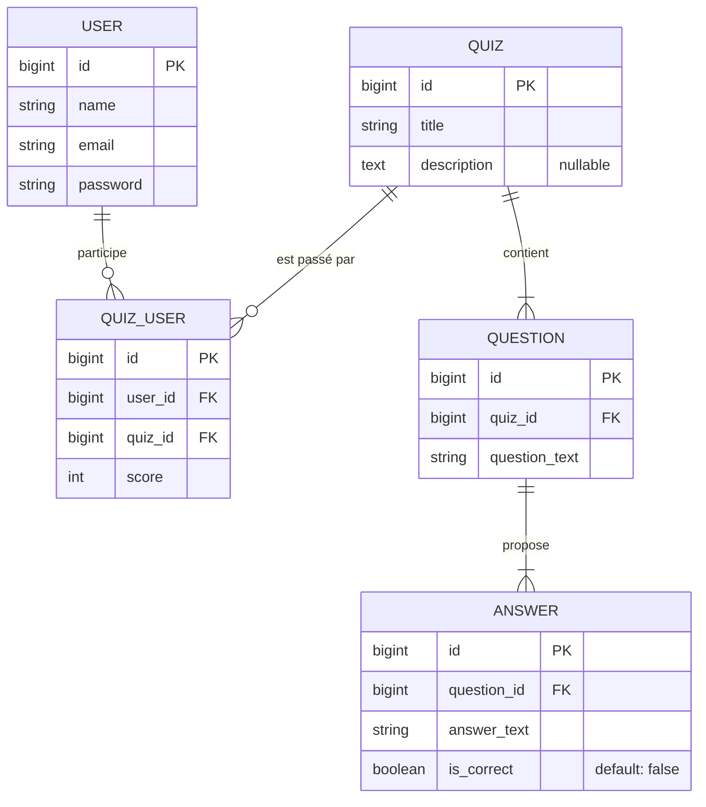

# 🧠 Modèle de Domaine & Données (MVP Quiz AI)

Ce document décrit de manière pragmatique les entités métier, les relations et la modélisation des données adoptées pour le MVP du générateur de quiz IA. Il sert de langage commun (Ubiquitous Language) pour les développeurs, le produit et les API.

---

## 1. Diagramme Entité-Association (ERD)

Voici les relations structurelles fondamentales de l'application.

---

## 2. Dictionnaire de Données et Contraintes

Le socle de données est volontairement simple et évite une surmodélisation académique.

### 🙎🏼‍♂️ Entité `User`
Gérée majoritairement par le scaffold d'authentification Laravel.
- **Rôle métier :** L'étudiant qui passe des quiz.
- **Données Clés :** `name`, `email` (unique), `password`.
- **Relations :** Peut posséder N participations (tables pivot `quiz_user`).

### 📝 Entité `Quiz`
Représente un ensemble de questions générées autour d'un sous-thème de cours.
- **Rôle métier :** Le support de contrôle de connaissances global. C'est l'entité mère des tests.
- **Données Clés :** 
  - `title` (VARCHAR) : Titre obligatoire (Ex: "Révolution Française").
  - `description` (TEXT) : Optionnel.
- **Relations :** Possède N `Question`. 

> [!NOTE]
> **Décision de Design MVP :** Actuellement, les Quiz sont considérés comme "Publics" et ne possèdent pas directement de clé étrangère `user_id` en tant que propriétaire/créateur formel. N'importe quel étudiant enregistré peut participer à un test.

### ❓ Entité `Question`
Représente une interrogation unique au sein d'un Quiz.
- **Rôle métier :** Vérifier une notion ciblée.
- **Données Clés :** 
  - `quiz_id` (FOREIGN KEY) : Le quiz parent.
  - `question_text` (VARCHAR) : L'intitulé (ex: "Quelle est la date de la prise de la Bastille ?").
- **Relations :** Possède obligatoirement N `Answer`. La suppression est gérée en `CASCADE` (supprimer le Quiz supprime toutes les questions enfants).

### ✅ Entité `Answer`
Représente un choix (QCM) rattaché à une question.
- **Rôle métier :** Proposer des distracteurs ou la bonne réponse pour le QCM généré par l'IA.
- **Données Clés :**
  - `question_id` (FOREIGN KEY) : Maintient le lien au parent.
  - `answer_text` (VARCHAR) : Le texte de l'option de QCM.
  - `is_correct` (BOOLEAN) : Permet à la logique métier ou l'API de validation de vérifier si l'étudiant a juste. Par défaut défini à `false`.
- **Relations :** Si la question est supprimée, la réponse l'est en `CASCADE`.

### 📊 Table Pivot `quiz_user` (Participation & Scores)
Gère l'historique et les résultats d'un étudiant sur un quiz.
- **Rôle métier :** Suivre la réussite de l'étudiant.
- **Données Clés :**
  - `user_id` et `quiz_id` (FOREIGN KEYS).
  - `score` (INTEGER) : Score total (généralement calculé via le backend lors de l'envoi), défaut à `0`.
- **Contrainte Forte :** Il existe un index unique composite `UNIQUE(user_id, quiz_id)`. Un utilisateur **ne peut avoir qu'un seul score mémorisé** (une seule participation prise en compte par le modèle) pour un quiz donné.

---

## 3. Règles Métier MVP (Business Rules)

Ces règles de gestion doivent être respectées lors des appels API et dans les couches 'Controllers' :

1. **Cycle de vie des Quiz (Cascade) :** Le découpage est strict. Retirer un `Quiz` du système entraîne *obligatoirement* le nettoyage de la base ( Questions -> Answers ). De même, les participations (`quiz_user`) liées s'effacent automatiquement sans laisser d'orphelins.
2. **Cohérence des Réponses :** Pour être sémantiquement valide face aux étudiants, chaque `Question` doit être liée en base à **au minimum deux réponses**, avec idéalement **une seule marquée `is_correct = true`**. L'API LLM devra impérativement cracher ce format structurel.
3. **Validité des Participations :** La table de classement / score ne laisse entrer qu'une association `[Utilisateur X / Quiz Y]`. L'interface devra prévoir un mécanisme d'`Upsert` (Update or Insert) si l'utilisateur repasse l'examen pour écraser son ancien score.
