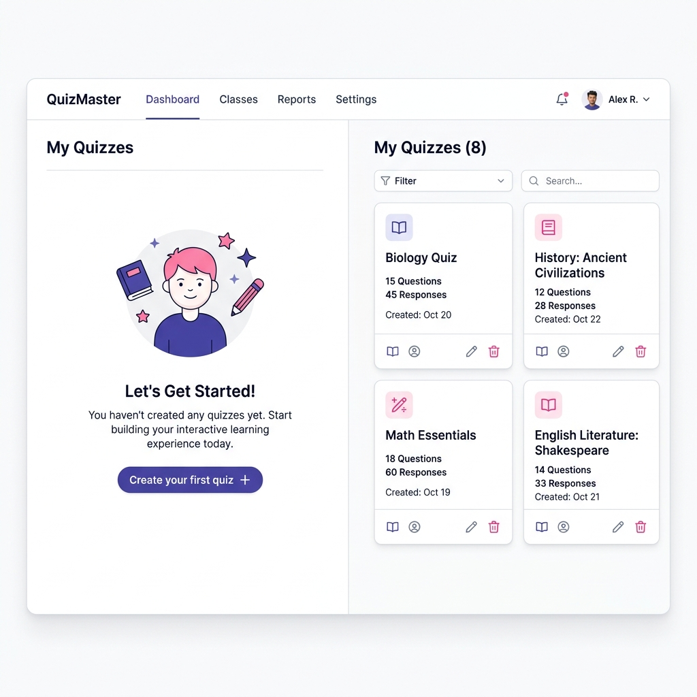
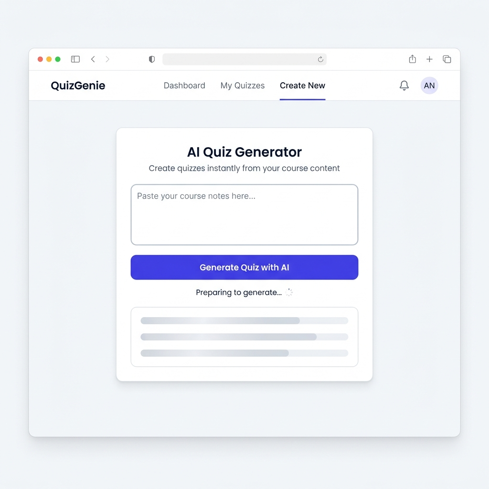
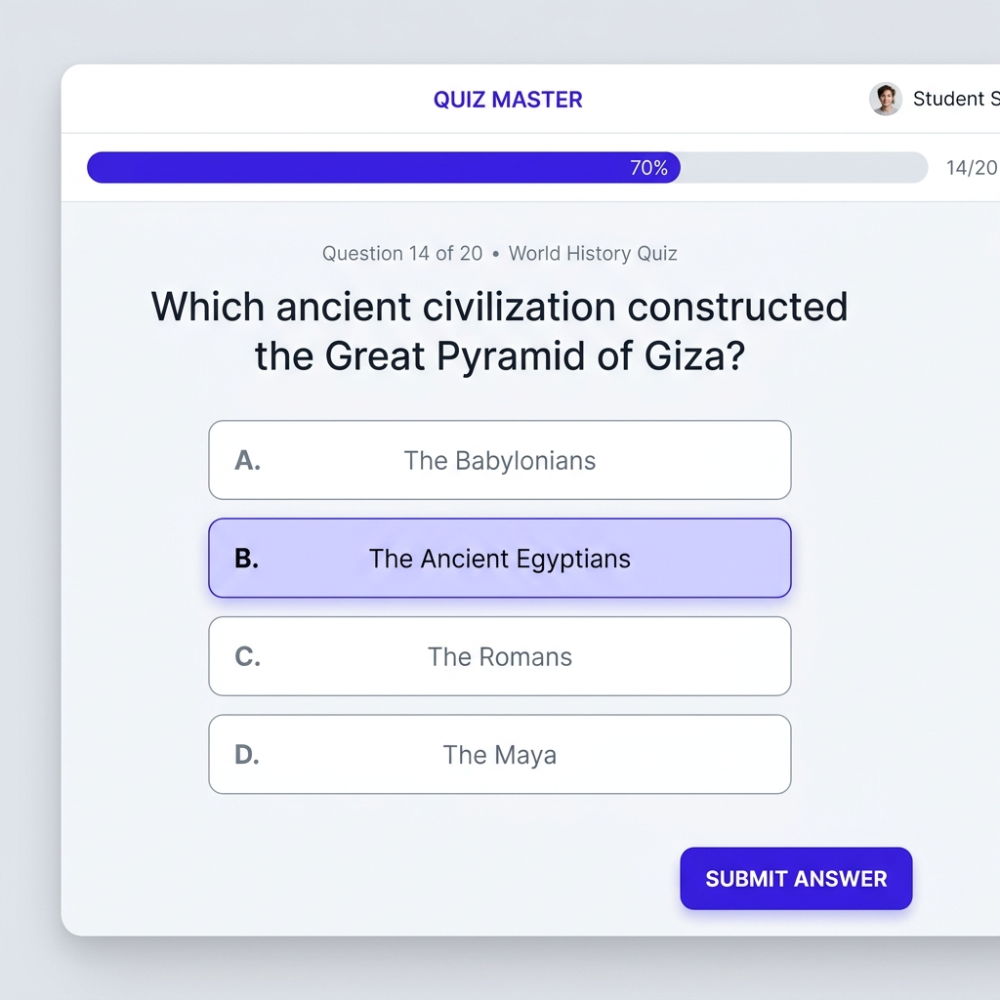

# 🎨 Mini-Guide UI/UX - Générateur de Quiz IA

Ce document décrit le socle de cohérence visuelle pour l'application QuizAI (US09). Il sert de référence pour le développement ou l'intégration des interfaces par les développeurs et les agents IA.

---

## 1. Grilles et Typographie

L'application doit privilégier un design aéré et minimaliste limitant la surcharge cognitive pour les étudiants.

- **Typographie principale :** `Inter` (sans-serif modene et lisible).
  - Titres (`H1` à `H3`) : Font-weight `700` ou `800` (Bold/Extrabold), tracking resserré (`tracking-tight`).
  - Corps de texte (`p`) : Font-weight `400` (Regular) ou `300` (Light), texte gris (`text-slate-600` ou `text-slate-500`).
- **Conteneurs :** Utilisation systématique de la classe `max-w-7xl mx-auto px-4 sm:px-6 lg:px-8` pour borner la largeur de l'interface et la centrer.
- **Espacement :** Les blocs logiques sont espacés généreusement (ex: `py-12`, `py-24`, `gap-8`).

---

## 2. Palette de Couleurs

L'interface interne utilise un thème propre et focalisé. Tout élément non essentiel est grisé ; les actions clés sont colorées pour guider l'œil.

- **Couleurs de fond :** 
  - Principal : Blanc pur (`bg-white`).
  - Secondaire (hors zones d'attention) : `bg-slate-50` ou `bg-slate-100`.
- **Textes :**
  - Titres : `text-slate-900`.
  - Paragraphes normaux : `text-slate-600`.
- **Couleur Primaire (Action & Focus) :** L'Indigo (`indigo-600` ou Primary Custom Hex `#4f46e5`). 
- **Couleurs de Statut Feedback :**
  - Essentiel pour la zone de chargement / état des quiz.
  - **Erreur :** `red-500` à `red-600` pour un feedback destructif ou un formulaire invalide.
  - **Succès :** `green-500` (ex: pour une bonne réponse de Quiz).
  - **Attention/Loading :** Utilisation d'états d'animation (`animate-pulse`) ou loaders.

---

## 3. Composants et Feedback Utilisateur

### 3.1. Boutons & Boutons d'Action (CTA)
- Tous les boutons interactifs ont des bords arrondis (soit `rounded-full` pour attirer l'attention principale, soit `rounded-lg` pour les actions standards).
- **Primary CTA :** `bg-primary-600 text-white hover:bg-primary-700 shadow-md`.
- **Secondary CTA :** `bg-white text-slate-700 border border-slate-200 hover:bg-slate-50`.
- **Disabled State :** Tous les boutons non clicables (exemple: chargement ou vide) doivent avoir la classe `opacity-50 cursor-not-allowed`.

### 3.2. Formulaires (Inputs & Textarea)
- Design sans bordures agressives, mise en avant subtile lors du clic.
- Focus State : Ajout d'un encadré clair `ring-2 ring-primary-500 border-primary-500`.
- Shadows : Ombre interne très discrète ou `shadow-sm`.

---

## 4. Gestion des États : Les 4 Maquettes Clés du Parcours

L'UX prévoit spécifiquement les différents états de flux pour une meilleure compréhension (Normal, Vide, Loading, Erreur).

### A. Écran d'accueil / Dashboard (Mon Espace)

Cet écran est scindé en deux concepts virtuels reflétant le statut de l'utilisateur :

- **État Vide (Nouvel étudiant) :** Pas de liste, mais une illustration sympathique motivant l'action centrale : *“Créer son premier quiz”*. On réduit l'anxiété de la page blanche.
- **État Normal :** Une grille cartographiée ou un style SaaS affichant les derniers quiz de l'étudiant sous la forme de cartes élégantes avec ombres douces (`shadow-sm`).

*Note : La maquette illustre ce contraste gauche (Etat vide) / droite (Etat rempli).*

### B. Générateur de Quiz par l'IA

- C'est l'écran le plus critique : La zone de saisie doit être la star (grand `textarea` confortable).
- **Le système de Feedback de chargement :** Appuyer sur *“Générer un Quiz avec l'IA”* va provoquer une attente (généralement 10s à 30s). On remplace ou ajoute un squelette UI (`Skeleton loader`) sous le bouton pour faire patienter visuellement et bloquer les clics doubles sur le moment de réponse. L'état d'erreur se traduit par une alerte rouge en bas sous le loader si l'API IA gèle.

### C. Passage d'un Quiz (Player de jeu)

L'objectif cognitif de l'interface du "Player" est d'optimiser la concentration sur une question à la fois.
- Une **Progress bar horizontale** se trouve en haut pour donner un feedback clair de l'avancement *(“Il me reste 3 questions”)*.
- Les choix de réponses sont larges, espacés, avec un feedback "Hover" au survol et "Active/Selected" (Indigo clair) au clic.
- Le Bouton Valider / Soumettre en bas est décalé sur la droite et devient cliquable de préférence quand une option est cochée.

---

> [!TIP]
> **Règle Universelle pour le Développement :** Avant de construire un nouvel écran pour le portail QuizAI, référez-vous toujours aux classes de TailwindCSS listées ci-dessus. N'utilisez pas de couleurs en dur (`#xxxxxx`) dans les classes sans les avoir mappées préalablement dans `tailwind.config.js`.
